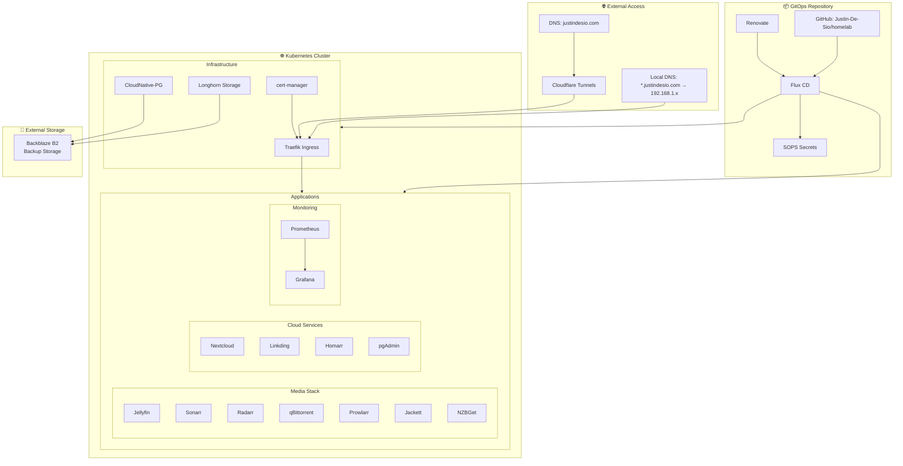

# 🏠 Homelab GitOps Infrastructure

[](https://fluxcd.io/)
[](https://github.com/mozilla/sops)
[](https://renovatebot.com/)
[](https://kubernetes.io/)

A production-ready, cloud-native homelab infrastructure managed entirely through GitOps principles using Flux CD. This repository contains the complete configuration for a Kubernetes-based homelab running media services, cloud storage, monitoring, and more.

> **🎯 This is a reference implementation showcasing enterprise-grade practices in a homelab environment.**

## 📋 Quick Overview

| **Component** | **Technology** | **Purpose** |
|---------------|----------------|-------------|
| **GitOps** | Flux CD + SOPS | Declarative infrastructure management |
| **Storage** | Longhorn | Distributed block storage with automated backups |
| **Database** | CloudNative PostgreSQL | Managed PostgreSQL with HA and continuous backup |
| **Monitoring** | Prometheus + Grafana | Comprehensive observability stack |
| **Media** | Jellyfin + *Arr Stack | Complete media automation and streaming |
| **Networking** | Traefik + Cloudflare | SSL termination and secure external access |
| **Security** | cert-manager + age encryption | Automated certificates and encrypted secrets |

## ️ Architecture

### 🗺️ System Architecture



### 📁 Repository Structure
```
homelab/
├── apps/                    # Application definitions
│   ├── base/               # Base configurations
│   └── production/         # Production overlays
├── infrastructure/         # Platform components
│   └── controllers/        # Infrastructure controllers
├── monitoring/            # Observability stack
├── clusters/              # Cluster configurations
│   └── homelab/          # Main cluster config
└── renovate.json         # Dependency automation
```

## Service Access
### 🌐 External Access
Secure external access via Cloudflare tunnels:
- `linkding.justindesio.com` - Bookmarks
- `cloud.justindesio.com` - Nextcloud  
- `video.justindesio.com` - Jellyfin
- `tv.justindesio.com` - Jellyfin Vue
- `dashboard.justindesio.com` - Homarr

### 🏠 Local Access

All services accessible via **Traefik ingress** with SSL certificates:

#### 📱 Applications
- `linkding.home.justindesio.com` - Bookmark manager (local-only)
- `jellyfin.justindesio.com` - Media server
- `cloud.justindesio.com` - Nextcloud file sync

#### 🎬 Media Management
- `sonarr.justindesio.com` - TV series automation
- `radarr.justindesio.com` - Movie automation  
- `prowlarr.justindesio.com` - Indexer management
- `jackett.justindesio.com` - Torrent trackers
- `qbittorrent.justindesio.com` - Torrent client
- `nzbget.justindesio.com` - Usenet downloader

#### ⚙️ Infrastructure
- `monitoring.justindesio.com` - Grafana dashboards
- `longhorn.justindesio.com` - Storage management
- `pgadmin.justindesio.com` - Database administration

## 🔄 Backup & Recovery

### **Storage (Longhorn)**
- **Daily** (2 AM, 7-day retention) + **Weekly** (Sunday 1 AM, 4-week retention) + **Monthly** (1st midnight, 6-month retention)
- **Snapshot cleanup** daily at 3 AM (7-day retention)
- Automated backups to **Backblaze B2** for `critical-data` volumes

### **Databases (CloudNative-PG)**
- **Continuous WAL streaming** with gzip compression to Backblaze B2
- **Linkding:** 3-day retention | **Nextcloud:** 7-day retention
- **Hourly WAL archiving** for point-in-time recovery