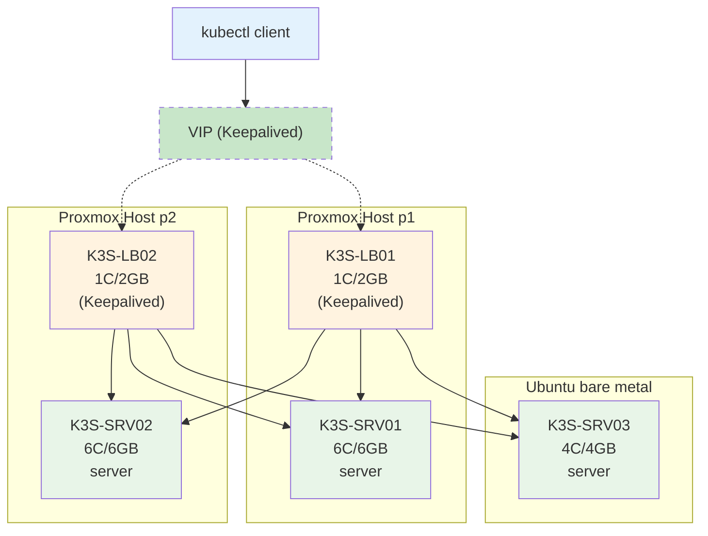

# 🏠 Homelab GitOps Infrastructure

[](https://fluxcd.io/)
[](https://github.com/mozilla/sops)
[](https://renovatebot.com/)
[](https://kubernetes.io/)

A personal homelab infrastructure managed through GitOps principles using Flux CD. This repository contains my ongoing configuration for a Kubernetes-based homelab running media services, cloud storage, and monitoring.

> **🏗️ Work in Progress:** Personal homelab setup that's constantly evolving and being improved.

## 📋 Quick Overview

| **Component** | **Technology** | **Purpose** |
|---------------|----------------|-------------|
| **GitOps** | Flux CD + SOPS | Declarative infrastructure management |
| **Storage** | Longhorn | Distributed block storage with automated backups |
| **Database** | CloudNative PostgreSQL | Managed PostgreSQL with HA and continuous backup |
| **Monitoring** | Prometheus + Grafana | Comprehensive observability stack |
| **Networking** | Traefik + Cloudflare | SSL termination and secure external access |
| **Security** | cert-manager + age encryption | Automated certificates and encrypted secrets |

## 📱 Applications

### **🏠 Dashboard & Management**
- **[Homarr](https://homarr.dev/)** - Customizable homepage and dashboard for homelab services

### **☁️ Cloud & Storage**
- **[Nextcloud](https://nextcloud.com/)** - Self-hosted cloud storage, file sync, and collaboration platform
- **[Immich](https://immich.app/)** - High-performance photo and video backup solution (Google Photos alternative)

### **🔖 Productivity**
- **[Linkding](https://github.com/sissbruecker/linkding)** - Self-hosted bookmark manager with full-text search

### **🎬 Media Stack**
- **[Jellyfin](https://jellyfin.org/)** - Media server for streaming movies, TV shows, and music
- **[Jellyfin Vue](https://github.com/jellyfin/jellyfin-vue)** - Modern web client for Jellyfin
- **[Sonarr](https://sonarr.tv/)** - TV series collection manager with automatic downloading
- **[Radarr](https://radarr.video/)** - Movie collection manager with automatic downloading
- **[Prowlarr](https://prowlarr.com/)** - Indexer manager for *Arr applications
- **[Jackett](https://github.com/Jackett/Jackett)** - API support for torrent trackers
- **[qBittorrent](https://www.qbittorrent.org/)** - BitTorrent client with web interface
- **[NZBGet](https://nzbget.net/)** - Usenet downloader

### **🗄️ Database Management**
- **[pgAdmin](https://www.pgadmin.org/)** - Web-based PostgreSQL administration tool


## ️ Architecture

### 📁 Repository Structure
```
homelab/
├── apps/                    # Application definitions
│   ├── base/               # Base configurations
│   └── production/         # Production overlays
├── infrastructure/         # Platform components
│   ├── controllers/        # Infrastructure controllers
│   └── configs/           # Infrastructure configurations
├── monitoring/            # Observability stack
│   ├── controllers/        # Monitoring controllers
│   └── configs/           # Monitoring configurations
├── clusters/              # Cluster configurations
│   └── homelab/          # Main cluster config
└── renovate.json         # Dependency automation
```

### 🖥️ Infrastructure Nodes



### 🔄 GitOps Flow & Dependencies

Flux CD orchestrates the deployment in a layered approach with proper dependencies:

```mermaid
graph TD
    A[🚀 infrastructure-controllers<br/>Longhorn, cert-manager, CloudNative-PG] 
    B[⚙️ infrastructure-configs<br/>Storage Classes, Node Config, Cluster Issuers]
    C[📊 monitoring-controllers<br/>Prometheus, Grafana]
    D[📈 monitoring-configs<br/>Dashboards, Alerts, Ingress]
    E[🔧 apps<br/>Nextcloud, Media Stack, pgAdmin]

    A --> B
    B --> C
    B --> E
    C --> D

    style A fill:#e1f5fe
    style B fill:#f3e5f5
    style C fill:#fff3e0
    style D fill:#fff8e1
    style E fill:#e8f5e8
```




## 🔄 Backup & Recovery

### **Storage (Longhorn)**
- Automated backups to **Backblaze B2** 
- **Daily** (7-day retention) + **Weekly** (4-week retention) + **Monthly** (6-month retention)
- **Snapshot cleanup** daily (7-day retention)

### **Databases (CloudNative-PG)**
- **Continuous WAL streaming** with gzip compression to Backblaze B2
- **Weekly** complet backup.

## Quick Start
```bash
terraform apply

ansible-playbook k3s.orchestration.site -i inventory.yml

flux bootstrap github \
  --token-auth \
  --owner=Justin-De-Sio \
  --repository=ssh://git@github.com/Justin-De-Sio/homelab\
  --branch=main \
  --path=clusters/homelab \
  --personal

kubectl create secret generic sops-age \
  --namespace=flux-system \
  --from-literal=age.agekey="${SOPS_AGE_KEY}"
```