# 🏠 Homelab GitOps Infrastructure

[](https://fluxcd.io/)
[](https://github.com/mozilla/sops)
[](https://renovatebot.com/)
[](https://kubernetes.io/)

A personal homelab infrastructure managed through GitOps principles using Flux CD. This repository contains my ongoing configuration for a Kubernetes-based homelab running media services, cloud storage, and monitoring.

> **🏗️ Work in Progress:** Personal homelab setup that's constantly evolving and being improved.

## 📋 Quick Overview

| **Component** | **Technology** | **Purpose** |
|---------------|----------------|-------------|
| **GitOps** | Flux CD + SOPS | Declarative infrastructure management |
| **Storage** | Longhorn | Distributed block storage with automated backups |
| **Database** | CloudNative PostgreSQL | Managed PostgreSQL with HA and continuous backup |
| **Monitoring** | Prometheus + Grafana | Comprehensive observability stack |
| **Media** | Jellyfin + *Arr Stack | Complete media automation and streaming |
| **Networking** | Traefik + Cloudflare | SSL termination and secure external access |
| **Security** | cert-manager + age encryption | Automated certificates and encrypted secrets |

## Quick Start

```bash
terraform apply

ansible-playbook k3s.orchestration.site -i inventory.yml

flux bootstrap github \
  --token-auth \
  --owner=Justin-De-Sio \
  --repository=ssh://git@github.com/Justin-De-Sio/homelab\
  --branch=main \
  --path=clusters/homelab \
  --personal

kubectl create secret generic sops-age \
  --namespace=flux-system \
  --from-literal=age.agekey="${SOPS_AGE_KEY}"
```


## ️ Architecture

### 📁 Repository Structure
```
homelab/
├── apps/                    # Application definitions
│   ├── base/               # Base configurations
│   └── production/         # Production overlays
├── infrastructure/         # Platform components
│   ├── controllers/        # Infrastructure controllers
│   └── configs/           # Infrastructure configurations
├── monitoring/            # Observability stack
│   ├── controllers/        # Monitoring controllers
│   └── configs/           # Monitoring configurations
├── clusters/              # Cluster configurations
│   └── homelab/          # Main cluster config
└── renovate.json         # Dependency automation
```

### 🔄 GitOps Flow & Dependencies

Flux CD orchestrates the deployment in a layered approach with proper dependencies:

```mermaid
graph TD
    A[🚀 infrastructure-controllers<br/>Longhorn, cert-manager, CloudNative-PG] 
    B[⚙️ infrastructure-configs<br/>Storage Classes, Node Config, Cluster Issuers]
    C[📊 monitoring-controllers<br/>Prometheus, Grafana]
    D[📈 monitoring-configs<br/>Dashboards, Alerts, Ingress]
    E[🔧 apps<br/>Nextcloud, Media Stack, pgAdmin]

    A --> B
    B --> C
    B --> E
    C --> D

    style A fill:#e1f5fe
    style B fill:#f3e5f5
    style C fill:#fff3e0
    style D fill:#fff8e1
    style E fill:#e8f5e8
```



**Deployment Layers:**
1. **infrastructure-controllers** - Core platform services (Longhorn, cert-manager, CloudNative-PG)
2. **infrastructure-configs** - Platform configuration (storage classes, certificates, database clusters) 
3. **monitoring-controllers** - Observability services (Prometheus, Grafana)
4. **monitoring-configs** - Monitoring configuration (dashboards, alerts, ingress rules)
5. **apps** - Applications that consume the platform services

## Service Access
### 🌐 External Access
Secure external access via Cloudflare tunnels:
- `linkding.justindesio.com` - Bookmarks
- `cloud.justindesio.com` - Nextcloud  
- `video.justindesio.com` - Jellyfin
- `tv.justindesio.com` - Jellyfin Vue
- `dashboard.justindesio.com` - Homarr

### 🏠 Local Access

All services accessible via **Traefik ingress** with SSL certificates:

#### 📱 Applications
- `video.justindesio.com` - Media server
- `cloud.justindesio.com` - Nextcloud file sync

#### 🎬 Media Management
- `sonarr.justindesio.com` - TV series automation
- `radarr.justindesio.com` - Movie automation  
- `prowlarr.justindesio.com` - Indexer management
- `jackett.justindesio.com` - Torrent trackers
- `qbittorrent.justindesio.com` - Torrent client
- `nzbget.justindesio.com` - Usenet downloader

#### ⚙️ Infrastructure
- `monitoring.justindesio.com` - Grafana dashboards
- `longhorn.justindesio.com` - Storage management
- `pgadmin.justindesio.com` - Database administration

## 🔄 Backup & Recovery

### **Storage (Longhorn)**
- **Daily** (2 AM, 7-day retention) + **Weekly** (Sunday 1 AM, 4-week retention) + **Monthly** (1st midnight, 6-month retention)
- **Snapshot cleanup** daily at 3 AM (7-day retention)
- Automated backups to **Backblaze B2** for `critical-data` volumes

### **Databases (CloudNative-PG)**
- **Continuous WAL streaming** with gzip compression to Backblaze B2
- **Weekly** complet backup.
